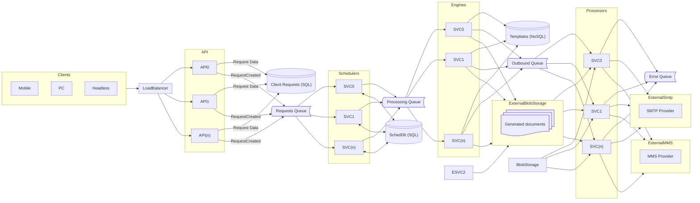


# Mail System (i.e. MailChimp, SendGrid)

## Approach
System runs in a Kubernetes cluster behind a cloud-based load balancer.

Items external to the cluster are all databases, message bus (i.e. SNS/SQS, Az Svc Bus), and blob storage (S3, etc);
***
## Components

### API
***
### Schedulers
Schedulers take incoming API requests from the queue and determine whether they need to be processed immediately, on a delay, or as a cron job.
***
### Engines
Engines are responsible for generating outbound content. Templates are pulled from a NoSql database where they are stored in JSON format.  Each engine knows how to process a template and create the finished content.

Upon generation, the completed content is uploaded to external blob storage.  Retention policy for generated content is likely beyond the scope of this initial design, but can envision a configurable policy of a reasonable value (eg. 30 days) for any issues and posterity.  Archiving any examples of content would be subject of a future discussion.

After content is uploaded to blob storage, an event is raised and sent to the Outbound Queue.
***
### Processors
Processors monitor the Outbound Queue and are responsible for transmitting the generated content via one or more external providers (eg. SMTP, SNS/MMS)
***
### Considerations

